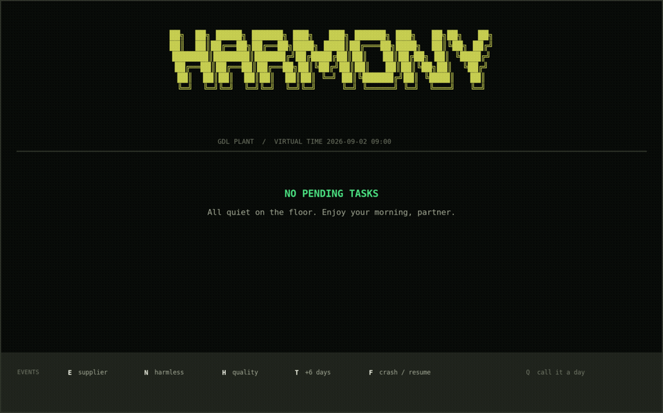

# Harmony Harness Demo

A durable, policy-gated enterprise agent harness built with **Effect 4**, **Bun**, **SQLite**, **Effect Workflow**, and **OpenRouter**.

The demo is intentionally not a chat wrapper around tools. It models the harder part of enterprise agents: reacting to enterprise events, interpreting every inbound email with an AI triage boundary, gathering permission-scoped evidence, asking an LLM for a bounded recommendation, enforcing deterministic policy, obtaining durable human approval, executing idempotent workflows, surviving process death, and reconstructing what happened from audit state.



## Reviewer quick path

If you have five minutes, read these files in order:

1. `src/harness/events/runtime/mail-ingress.ts`: every inbound email crosses AI triage and can immediately start a routed agent.
2. `src/harness/agent/execution/agent-harness.ts`: generic proposal/approval/execution orchestration; it imports no purchasing or quality implementation.
3. `src/harness/authorization/policy/gate.ts` + `src/harness/authorization/policy/policy-engine.ts`: generic gate and composable policy kernel.
4. `src/app/policy-engine-layer.ts`: installed business policy rules.
5. `src/harness/tools/runtime/tool-runtime.ts`: runtime scope checks, idempotency, and correlated side-effect audit.
6. `src/domain/purchasing/workflows/reroute-purchase-order.ts`: the durable six-step workflow and compensation.
7. `test/harness.integration.test.ts`: executable event, safety, approval, and restart claims.
8. `artifacts/scenario-a.recorded.ndjson`: a deterministic end-to-end Scenario A audit.
9. `docs/DESIGN.md` and `MODEL.md`: design, model, evaluation, and production path.

The executable source of truth is local and simple: frozen Bun install, strict TypeScript, the Bun-native integration suite, the complete deterministic demo, and the recorded Scenario A audit.

## Scenario A: email event → AI triage → durable PO reroute

The synthetic plant is RealTruck Guadalajara. A supplier email says `PO-77812` for part `RT-4471` will arrive too late for production order `4812`.

There is no polling step in the primary path. A mail adapter hands the received message to `MailIngress.received(...)`. **Every inbound email is sent through the configured `MailTriage` AI first.** The model receives the installed route names/descriptions and returns either `IgnoreMail` or a route name. Email content is treated as untrusted data and cannot register its own route.

The deterministic demo first delivers an irrelevant facilities email, which the AI triage boundary ignores. It then delivers the supplier delay, which is routed to `purchasing.supply-risk`. The registered purchasing route immediately checks live ERP/production state, creates a durable attention item only when the risk is real, and calls the normal agent planner without waiting for another scan or user prompt.

The full path is:

```text
mail adapter / webhook
        │
        ▼
   MailIngress
        │
        ▼
 AI mail triage                         ← every incoming email
   Ignore │ Route
          ▼
   MailRouteCatalog                     ← installed extension routes
          │
          ▼
 deterministic domain detector
          │
          ▼
 durable AttentionItem ── dedupe
          │
          ▼
 ContextResolverCatalog
          │
          ▼
 scoped ERP / Mail / Calendar evidence
          │
          ▼
 OpenRouter planner                     ← bounded recommendation only
          │
          ▼
 generic Gate → composed PolicyEngine
          │
          ▼
 durable human approval
          │
          ▼
 RecommendationExecutor
      ┌───┴──────────┐
      ▼              ▼
Effect Workflow   bounded tools
      └──────┬───────┘
             ▼
        ToolRuntime
 scope recheck + idempotency + audit
```

For the reroute, deterministic policy rejects the tempting cheap but unapproved supplier `S-Q`, rejects a no-op reroute back to incumbent `S-Y`, applies monetary authority, and binds approval to an immutable plan hash. `purchasing.reroute-po@1` then confirms the alternate supplier, confirms lead time, creates the replacement PO, cancels the old PO, notifies production, and persists the Tuesday arrival check in fixed order.

A separate failure fixture kills the worker with real `SIGKILL` immediately after PO creation. A fresh Bun process reopens the same workflow state and resumes without creating a second PO.

## Scenario B: extension without changing the kernel

A quality hold lands on a lot allocated to upcoming production. The quality extension provides its own context resolver and bounded actions. The planner may reallocate a valid lot and notify production, or flag a shortage when no lot covers demand.

The important architectural property is that `AgentHarness` does not import `SupplyRiskContext`, `QualityHoldContext`, or the purchasing workflow. Context resolution, recommendation execution, mail routing, and business policy are registered at composition time through catalogs/services. Adding another business domain should extend those composition layers instead of adding another `if (domain === ...)` to the kernel.

## Kernel vs. environment

`harness/` contains the reusable orchestration/safety primitives. `domain/` contains installed business capabilities. `integrations/` defines provider contracts and concrete adapters. `app/` composes the installed capabilities into catalogs and policy sets.

The local RealTruck dataset, SQLite enterprise adapters, deterministic AI fixtures, and OpenRouter demo deployment are explicitly composed under `src/environments/demo/`. They are not embedded inside `AgentHarness`.

A production deployment can keep the same harness/domain code and replace the environment edges, for example:

```text
SQLite ERP          → SAP / Oracle / Dynamics adapter
SQLite Mail         → Microsoft Graph / Gmail adapter
SQLite Calendar     → Microsoft Graph / Google Calendar adapter
mail demo callback  → provider webhook / event subscription
local SQLite state  → managed SQL workflow/harness state
```

The thin files under `src/infra/runtime/` are compatibility re-exports; the actual demo composition lives under `src/environments/demo/`.

## Run it

Requirements: Bun 1.3.12 or newer and an OpenRouter API key for the live AI path.

For convenience, this review copy already has an OpenRouter API key in `.env` with a $1 spending limit ;). If you replace it, please keep the same kind of tight limit and never commit a production credential.

```bash
bun install --frozen-lockfile
bun run check
bun run demo             # interactive approval UI
bun run demo:auto        # deterministic, non-interactive reviewer run
```

On a fresh checkout without that convenience file, copy `.env.example` to `.env` and add your own limited OpenRouter key.

Default configuration:

```text
DATABASE_PATH=.data/harmony.db
OPENROUTER_MODEL=z-ai/glm-5.3-flash
```

The live demo uses OpenRouter twice for a relevant supplier email: first for immediate email relevance/routing, then for the evidence-backed agent recommendation. Irrelevant mail only incurs the triage call.

The interactive demo pauses on real durable approval records. Press `A` to approve, `D` to decline, or `Q` to quit. Approval executes the proposed workflow/actions; declining records the decision without executing writes.

For a deterministic reviewer run:

```bash
bun run demo:auto
```

Useful operator commands:

```bash
bun run src/cli/main.ts approval list
bun run src/cli/main.ts approval approve <approval-id> --reviewer <reviewer-id>
bun run src/cli/main.ts approval reject <approval-id> --reviewer <reviewer-id> --reason "reason"
bun run src/cli/main.ts run execute <run-id>
bun run src/cli/main.ts audit show <run-id>
bun run src/cli/main.ts clock advance <iso-instant>
```

## Validation

```bash
bun run typecheck
bun run test
```

The integration suite covers:

| Property | What is asserted |
| --- | --- |
| Event-driven AI ingress | irrelevant email is AI-triaged to ignore; supplier delay is routed and immediately starts one agent run |
| Event/attention dedupe | repeating the same delivered message cannot create a second agent run; durable attention keys cannot be inserted twice |
| Supplier qualification | an unapproved supplier is rejected before any write |
| True reroute invariant | the current supplier cannot be accepted as its own alternate |
| Runtime authorization | revoking `erp:po:create` blocks the write at `ToolRuntime` even after planning |
| Backup approval routing | unanswered approval moves to the configured backup when the primary is OOO tomorrow |
| Scheduled EOD routing | a real Scenario A approval gets an EOD job and is routed by the due-work dispatcher |
| Tuesday re-entry | a missing replacement PO creates a new attention item and a second gated agent run |
| Workflow audit order | all six declared workflow steps complete in definition order in the audit |
| Scenario B branches | a covering lot reallocates and notifies; insufficient stock flags purchasing |
| Workflow identity | replaying the same run is idempotent while a distinct agent run gets a distinct workflow execution |
| Crash durability | a real `SIGKILL` is followed by fresh-process resume with no duplicate replacement PO |

The deterministic demo runs the complete story and writes the Scenario A audit artifact.

## Recorded run

`artifacts/scenario-a.recorded.ndjson` is generated by the deterministic demo. It includes ingress, evidence, approval, all six workflow steps, concrete writes, the Tuesday check, and the follow-up agent run. The live OpenRouter path uses the same `MailIngress`, route catalog, context catalog, policy engine, approval, workflow, tool runtime, persistence, and audit components; only the AI service layers differ.

Mail ingress itself also writes audit events (`mail.received`, `mail.triaged`, `mail.routed`) under the mail event identity, while the spawned agent run has its own traceable context/planner/policy/approval/execution history.

## Evaluation

```bash
bun run benchmark          # five cases × three live repetitions
bun run benchmark:replay   # re-score stored outputs without another model call
```

The planner benchmark covers happy-path reroute, irrelevant evidence, unapproved-supplier temptation, quality-lot reallocation, and quality shortage. It checks recommendation shape, workflow/action selection, workflow parameters such as `alternateSupplierId`, evidence grounding, and forbidden values. See `MODEL.md` and `src/harness/evaluation/`.

## Repository layout

```text
src/
  app/                    installed capability composition: contexts, routes, policies, executors, tools
  cli/                    reviewer/operator surface
  domain/
    purchasing/           purchasing models, event detector, tools, durable workflow
    quality/              quality models, detector, bounded tools
  environments/
    demo/                 SQLite/OpenRouter live composition + deterministic test composition
  harness/
    agent/                generic attention, context catalog, execution, planner contract
    approvals/            durable approval state and backup routing
    audit/                evidence + append-only event trail + export
    authorization/        principals, generic gate, composable policy engine
    events/               inbound mail model, AI triage, route catalog, ingress runtime
    evaluation/           benchmark fixtures, scoring, reporting
    memory/               durable agent-run records
    scheduling/           virtual business clock + follow-up work
    tools/                catalog + runtime authorization/idempotency
    workflows/            generic workflow runtime/versioning support
  infra/
    config/               Effect Config
    database/             harness/demo persistence, migration, fixture seed/reset
    workflow/             SQL-backed Effect Workflow engine
  integrations/
    erp/                  provider contract + SQLite adapter
    mail/                 provider contract + SQLite adapter
    calendar/             provider contract + SQLite adapter
    openrouter/           Effect AI planner + inbound-mail triage
  scenarios/              demo-only events, narration, crash fixture

test/                     Bun-native integration suite
artifacts/                recorded/generated audit evidence
docs/DESIGN.md            submission design document
MODEL.md                   company model choices + AI/evaluation notes
```

## Adding a capability

The extension path is intentionally boring. That is a feature here.

**Tool:** define input/output schemas and required scopes with `defineTool`, implement the adapter-side effect, register it in `src/app/tool-catalog-layer.ts`, then add denial and idempotency tests. Agent writes must still go through `ToolRuntime`.

**Provider:** add a narrow contract under `src/integrations/`, implement the local or real connector, enforce read scopes inside the adapter, and expose returned facts as evidence snapshots from a context resolver.

**Detector:** turn a schedule or provider event into an `AttentionItem` with a stable business dedupe key. Register its context kind in `src/app/context-resolver-layer.ts`; if it is mail-driven, register the bounded route in `src/app/mail-route-layer.ts` too.

**Workflow:** declare a versioned workflow with fixed activities, keep mutable checks inside activities, route every write through a registered tool, add meaningful compensation for completed writes, and register execution in `src/app/recommendation-executor-layer.ts`. Add a resume test before calling it done.

## Safety invariants

- **Every inbound email crosses AI triage.** A routed email can start an agent immediately; there is no polling delay in Scenario A.
- **AI triage cannot execute anything.** It only chooses among registered route names or ignores the message.
- **No planner-to-tool path.** The planning model emits a typed recommendation only.
- **The kernel does not select business domains with hard-coded branches.** Context, routes, policies, and execution are composed services/catalogs.
- **Read permissions are enforced before data reaches planning.** Provider adapters reject unauthorized reads.
- **Write permissions are checked at policy time and again immediately before tool execution.**
- **A reroute must actually reroute.** Policy and workflow both reject the incumbent supplier as the alternate.
- **Approval binds to an immutable plan hash and is revalidated before execution.**
- **Tool side effects have persisted idempotency independent of workflow replay.**
- **Evidence and concrete side effects are auditable.**
- **The failure proof uses actual process death.**

## Deliberate tradeoffs

Analyzing every inbound email with an LLM is a deliberate latency/coverage choice in this demo. At enterprise scale it should be protected with provider-webhook dedupe, concurrency limits, quotas, data-residency controls, and an organization policy for what mail may be sent to the selected model. The architecture keeps triage as an injectable `MailTriage` service so a customer can use a private/on-prem model, a cheaper classifier, or a stricter routing model without changing the event or agent kernel.

The local environment uses SQLite so the submission is portable. Real enterprise adapters would use delegated provider credentials and webhook/event subscriptions. Those substitutions happen at the environment/integration boundary, not inside `AgentHarness`.

For identity/auth, long-term memory, scaling to thousands of employees, graph-first workflow tradeoffs, failure semantics, and the production path, see `docs/DESIGN.md`.

## What we cut

We cut a hosted webhook service, real SSO/token exchange, distributed queues, managed workflow storage, a document-search connector, graphical workflow authoring, and a web approval UI. The local contracts show where those pieces connect, but thin imitations would not make these scenarios safer.
